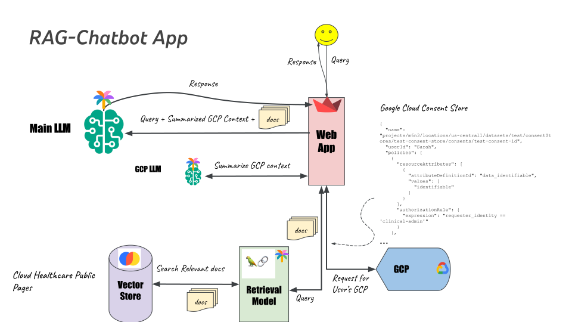

# rag-chatbot
RAG-chatbot: A RAG chatbot for Google cloud healthcare


A fully functional chatbot that leverages Google Cloud Healthcare public documentation to answer questions. It utilizes the Google PALM2 API for language model capabilities, Chroma for vector database operations, and Streamlit for the web application interface.




## Demo


## Usage

```bash
python3 -m venv myvenv
source myvenv/bin/activate

git clone https://github.com/m6n3/rag-chatbot.git
cd diffusion-pytorch
python -m pip install --upgrade pip
python -m pip install --upgrade wheel
python -m pip install --upgrade .
pip install -r requirements.txt

# Set PALM2 API key or you will be asked in the webapp to enter it.
# You can get one from https://makersuite.google.com/app/apikey
GOOGLE_API_KEY="PALM_API_KEY"


streamlit run app.py  # runs the webapp at http://localhost:8051
```


**Note:** When you run the app for the first time, it downloads Google Cloud public pages and builds an index, which can take a considerable amount of time. You can expedite the process by reducing the number of pages to download. Simply modify the value of the `MAX_PAGES` variable in the `chatbot_llm.py` file.

